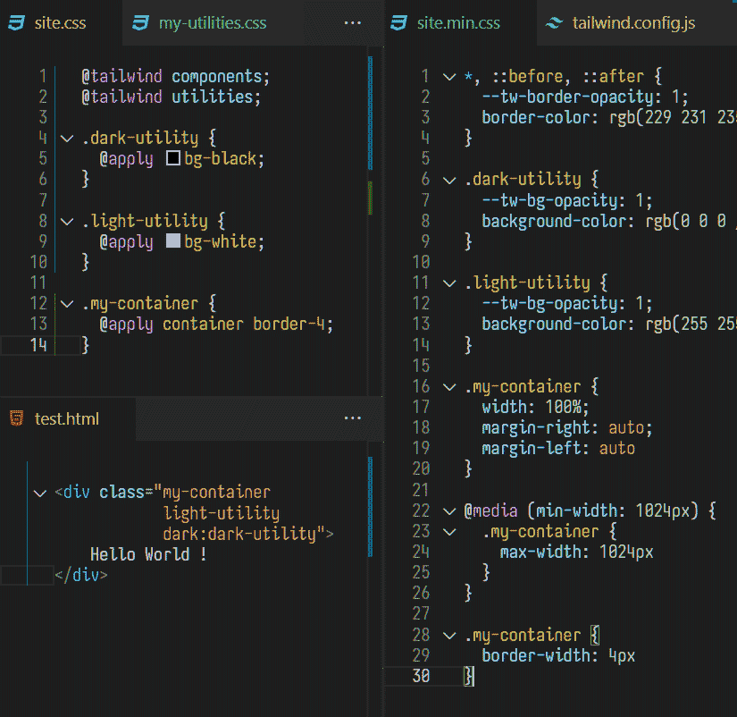
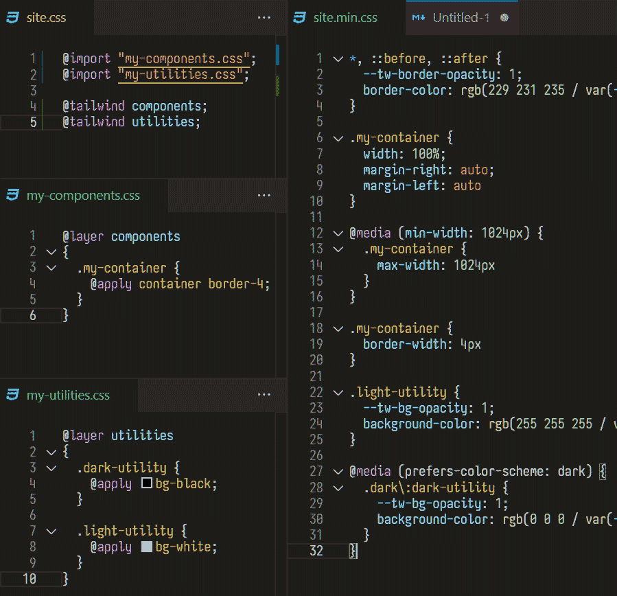

:::: nav

[PostCSS](/notes#postcss)
[Tailwind Directives](/notes#directives)
:::
- [@layer](/notes#layer)
- [@tailwind](/notes#tailwind)
:::
[`npm` Alternatives](/notes#NPM)
:::
- [Standalone CLI](/notes#CLI)
- [CDN](/notes#CDN)
:::
[Visual Studio](/notes#VS)
[VS Code](/notes#VSCode)

::::

:::: content

# .NET 7 / Tailwind CSS 3.2 migration

As i work on rehashing the site for these updates, i'll be using this section as a dumping ground for new content that should find a more appropriate home later on.  See the [readme](https://github.com/McNerdius/TailBlazor/blob/main/readme.md){target="_blank"} to see how that's going.

* The new `blazor*-empty` templates are a great addition to .NET 7, as are the new [loading progress properties](https://devblogs.microsoft.com/dotnet/asp-net-core-updates-in-dotnet-7-preview-7/#new-blazor-loading-page){target="_blank"}.  But the `-empty` templates don't show off tese additions.  I've updated the `tailblazor.dev` awesomeface-loader to show progress by extending `width` and `content` in tailwind config, wrapping the new CSS properties/variables.  In `tailblazor-templates` i will stick to the .NET 7 "full" template's design, with some Tailwind peppered in.
*  


# A bit more on PostCSS {#postcss}

As mentioned in [setup](/setup#postcss), the `tailwindcss` CLI wraps PostCSS functionality and bundles a few essential plugins: `postcss-import`, `autoprefixer`, and `cssnano`.  They don't need to be installed manually, and will be applied automatically if you don't pass a `postcss.config.js` file to the CLI.

The essential plugins, in the order they should be run:

- [`postcss-import`](https://github.com/postcss/postcss-import){target="_blank"} mimics vanilla CSS `@import` by inlining the contents of the css files being imported.  As such, it should always be the first plugin applied to your input CSS.

- `tailwindcss` - yep, `tailwindcss` itself is a PostCSS plugin.  

- [`autoprefixer`](https://github.com/postcss/autoprefixer){target="_blank"} applies "vendor prefixes" to your CSS to accommodate vendor-specific implementations of CSS features.  This should run second-to-last, after all CSS is built up.

- [`cssnano`](https://cssnano.co/docs/introduction/){target="_blank"} optionally minifies your output CSS, if you pass `--minify` to the CLI.  Obviously this needs to be run last !

The above is how it works without passing `--postcss postcss.config.js` to the `tailwindcss` CLI.  Opting for a `postcss.config.js` means we have to spell things out a bit, which is what i've shown in [setup](/setup#postcss) and [nesting](/tidy_css#nesting).  Here's a simplified view of things - noting that if you do use a `postcss.config.js`, the extra plugins you're using should be sandwiched between `postcss-import` at the top, and `tailwindcss` at the bottom.

[](../images/postcss.drawio.svg){target="_blank"}

## Tailwind's Default `init --postcss` Config {#postcssconfig}

The default `postcss.config.js` includes itself and `autoprefixer` explicitly:

```javascript:postcss.config.js
module.exports = {
  plugins: {
    tailwindcss: {},
    autoprefixer: {},
  }
}
```

This file, as-is, is only needed _if you're not using the `tailwindcss` CLI directly_. If one were to use other JS tooling, it would be needed. When using the `tailwindcss` CLI directly:

- `autoprefixer` never needs to be listed, `tailwindcss` will do that for us.
- `tailwindcss` only needs to be listed if it's not running first, as is the case with `postcss-import` or [`tailwindcss/nesting`](/next#nesting). So here's what my default `postcss.config.js` looks like when i'm using the nifty nesting plugin:

```javascript:postcss.config.js
module.exports = {
    plugins: {
        'postcss-import': {},
        'tailwindcss/nesting': {},
        tailwindcss: {},
    },
}
```

::: info

Tailwind CSS v3.1 ["bakes in" `postcss-import`](https://tailwindcss.com/blog/tailwindcss-v3-1#built-in-support-for-css-imports-in-the-cli), but not to the same degree as `autoprefixer` and `cssnano`.  Those two never need to be listed in `postcss.config.js`, whereas `postcss-import` still needs to be listed first.  So it's, uh, half-baked-in, one could say.

:::

---

# Tailwind CSS Directives  {#directives}

Let's take a look at how `postcss-import` influences the way we use Tailwind's [`@layer` and `@tailwind` directives](https://tailwindcss.com/docs/functions-and-directives#directives){target="_blank"}.

## The `@layer` directive {#layer}
In short, the [`@layer` directive](https://tailwindcss.com/docs/adding-custom-styles#using-css-and-layer){target="_blank"} tells the Tailwind CLI to give your CSS a bit of extra attention.  It will be output along with the associated layer ([recap](setup#boilerplate-bg){target="_blank"}) rather than inline, and be usable with modifiers like `hover`, dark mode, responsive breakpoints, etc.  (For the following examples i've overriden `screens` in `tailwind.config.js` to only include a single `1024px` breakpoint.  Better quality images at some point, 4 bit is a bit ugly, eh. 🤔)

Here's example without use of layers: note the ordering, and that while `dark-utility` is generated, `dark:dark-utility` won't *actually work*:

[](../images/step1-vanilla.png){target="_blank"}

Adding `@layer` into the mix, we get smart ordering and a proper `dark:dark-utility`:

[](../images/step2-layer.png){target="_blank"}

Finally, putting our custom `layer` CSS in their own files:

[](../images/step3-import.png){target="_blank"}

## The `@tailwind` directive {#tailwind}

Revisiting a basic `Site.css` boilerplate:

```css:site.css
@import "tailwindcss/base";
@import "tailwindcss/components";
@import "tailwindcss/utilities";
@import "./obj/net6.0/scopedcss/bundle/site.styles.css";
```

Some notes:

- We have to `@import` to use Blazor's generated CSS Isolation bundle.
- All `@import` directives have to be at the top of the file.
- Tailwind's layers *could be* imported at the bottom using the `@tailwind` directive.
- `site.styles.css` is really more of a "components" thing, and could be moved up a line.
- Moving it up a line would *require* `@import "tailwindcss/utilities";`, as opposed to `@tailwind utilities`.

While it's not *always* necessary to use `@import` syntax versus `@tailwind` syntax when using `postcss-import`, i like to stick with the one syntax that works in all cases.  See more about this sort of thing on Tailwind's [build time imports](https://tailwindcss.com/docs/using-with-preprocessors#build-time-imports){target="_blank"} docs section.

---

# `npm` Alternatives

I'm not a web developer, and the JS ecosystem is a bit churny and disjointed for me to keep up with.  Using vanilla CSS wouldn't require any of that, but it is my biggest source of frustration in learning front-end development.  Tailwind CSS just "clicks" for me.  

The way i've shown how to set things up on this site requires installation of Node.js, `tailwindcss` itself, maintaining a few config files, etc.  Several steps but it really is one "real" install (`tailwindcss` CLI being more of a dependency) and boilerplate.  Once it's in place, you'll rarely have to think about `npm` or other JS tooling - `MSBuild` takes care of all that for us behind the scenes.  That said - is there a *better*, Node.js-free alternative ?  Emphasis on *better*.

## Tailwind Standalone CLI {#CLI}

Tailwind 3+ offers a [standalone CLI](https://tailwindcss.com/blog/standalone-cli){target="_blank"} - not to be confused with the ordinary `tailwindcss` CLI.  At the time of writing, the singular advantage is that Node.js isn't required.  Unfortunately, third party PostCSS or Tailwind plugins (such as `debug-screens`) can't be used with it, nor can the `npm` build scripts (`npm run build` etc).

Even when/if third-party plugins are supported, the standalone CLI and plugins will have to be acquired/installed somehow.  Will this be a better developer experience than doing so via `npm` ?  Consider continuous deployment - most if not all virtual machines will have Node.js preinstalled.

---

## Tailwind CDN {#CDN}

- Old: Don't use it
- [New](https://www.youtube.com/watch?v=mSC6GwizOag){target="_blank"}: Nifty, but not for production.

---

# Visual Studio {#VS}

I've mentioned it before but worth repeating: the [NPM Task Runner](https://marketplace.visualstudio.com/items?itemName=MadsKristensen.NpmTaskRunner64){target="_blank"} seems to be the ideal way to take full advantage of Tailwind's watch & incremental builds within Visual Studio.

---

# VS Code {#VSCode}

The [Tailwind CSS Extension](https://marketplace.visualstudio.com/items?itemName=bradlc.vscode-tailwindcss){target="_blank"} is incredible. Its intellisense is dynamic: it will pick up on new or overridden values in `tailwind.config.js` as well any [utility classes](https://tailwindcss.com/docs/adding-new-utilities){target="_blank"} or [plugins](https://tailwindcss.com/docs/plugins){target="_blank"} you've added. It also provides previews of the generated vanilla CSS on hover in the same dynamic manner:

 

 Version 3.1 of Tailwind CSS brings "[First-party TypeScript types
](https://tailwindcss.com/blog/tailwindcss-v3-1#first-party-type-script-types)", which improves the intellisense experience further.

---

::::
